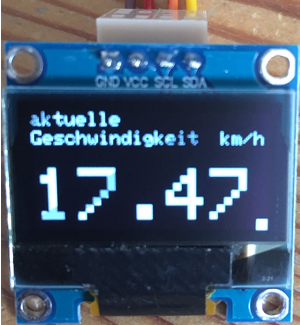

# Fahrrad-Computer
Fahrrad-Computer mit einem NANO, OLED-Display, Encoder und Hall-Sensor

 

 

## Strory

Diese Anleitung beschreibt einen Fahrrad-Computer. Auf einem OLED-Display werden Geschwindigkeit, Durchschnitts-Geschwindigkeit, Fahrzeit und Gesamtstrecke angezeigt. Mit einem Drehwinkelgeber werden die Seiten am Display ausgewählt. Auf Knopfdruck (Drehwinkelgeber) können die Werte gelöscht werden.

## Hardware

+ 1 x NANO
+ 1 x Drehwinkelgeber KY-040
+ 1 x OLED-Display SSD1306, 128x64 Pixel
+ 1 x Hall-Sensor-Modul KY-024
+ 1 x Speichenmagnet
+ 1 x 9-V-Batterie inklusive Batterieclip
+ 3 x Kunststoffgehäuse (ca. 2,5 cm x 3,5 cm x 6 cm)
+ Kleinmaterial, Kabelbinder, Klemmen, Schaltdraht

  
## Verdrahtung

NANO - Drehwinkelgeber KY-40:

NANO  		KY40

GND		GND

+5V		+5V

D5		SW

D4		DT

D3		CLK

NANO - Hall-Sensor-Modu KY-024:

NANO  		KY-024

GND		GND

+5V		+5V

D2		D0

NANO - 9V-Batterie:

NANO  		9V

GND		GND

Vin		+5V

---

