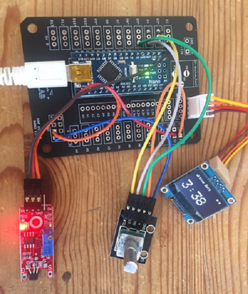
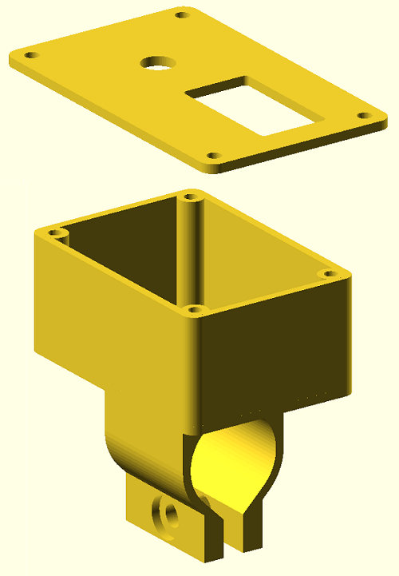
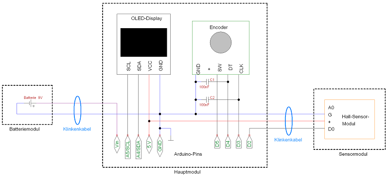

|[:skull:ISSUE](https://github.com/frankyhub/Fahrrad-Computer/issues?q=is%3Aissue)|[:speech_balloon: Forum /Discussion](https://github.com/frankyhub/Fahrrad-Computer/discussions)|[:grey_question:WiKi](https://github.com/frankyhub/Fahrrad-Computer/wiki)||
|--|--|--|--|
| | | | |
||<a href="https://github.com/frankyhub/Fahrrad-Computer/issues">|<a href="https://github.com/frankyhub/Fahrrad-Computer/discussions">|<a href="https://github.com/frankyhub/Fahrrad-Computer/releases">|
|| <a href="https://github.com/frankyhub/Fahrrad-Computer/pulse" alt="Activity">| <a href="https://github.com/frankyhub/Fahrrad-Computer/graphs/traffic">  |<a href="https://github.com/frankyhub?tab=stars"> |

# Fahrrad-Computer
Fahrrad-Computer mit einem NANO, OLED-Display, Encoder und Hall-Sensor

 

 

## Story

Diese Anleitung beschreibt einen Fahrrad-Computer. Auf einem OLED-Display werden Geschwindigkeit, Durchschnitts-Geschwindigkeit, Fahrzeit und Gesamtstrecke angezeigt. Mit einem Drehwinkelgeber werden die Seiten am Display ausgewählt. Auf Knopfdruck (Drehwinkelgeber) können die Werte gelöscht werden.

## Hardware

+ 1 x NANO
+ 1 x Drehwinkelgeber KY-040
+ 1 x OLED-Display SSD1306, 128x64 Pixel
+ 1 x Hall-Sensor-Modul KY-024
+ 1 x Speichenmagnet
+ 1 x 9-V-Batterie inklusive Batterieclip
+ 3 x Kunststoffgehäuse (ca. 2,5 cm x 3,5 cm x 6 cm)
+ Kleinmaterial, Kabelbinder, Klemmen, Schaltdraht

  
## Verdrahtung

NANO - Drehwinkelgeber KY-40:

| NANO  | KY-40 | 
| -------- | -------- | 
| GND  |  GND  |
| +5V  | +5V   |
| D5	  | SW  |
| D4  |  DT  |
| D3  | CLK   |
|  --- |  ---  |

NANO - Hall-Sensor-Modu KY-024:

| NANO  | KY-024 | 
| -------- | -------- | 
| GND  | GND   |
|  +5V		 |  +5V		  |
| D2  | D0   |
| ---  | ---   |

NANO - 9V-Batterie:

| NANO | 9V | 
| -------- | -------- | 
| GND	  |  GND	  |
|  Vin	 |  +5V  |
|  --- |  ---  |

## Schaltplan

---

   
<ol class="breadcrumb" style="border-top: 2px solid black;border-bottom:2px solid black; height: 45px; width: 900px;"> 
<a href="#oben">nach oben</a>
</ol>

  

---

